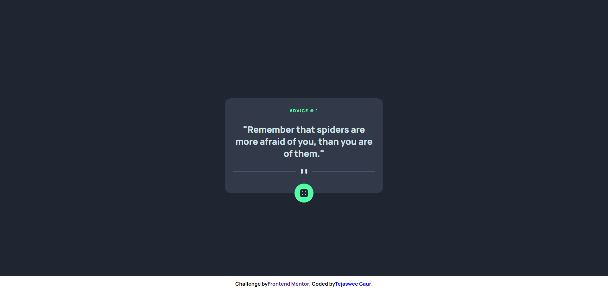
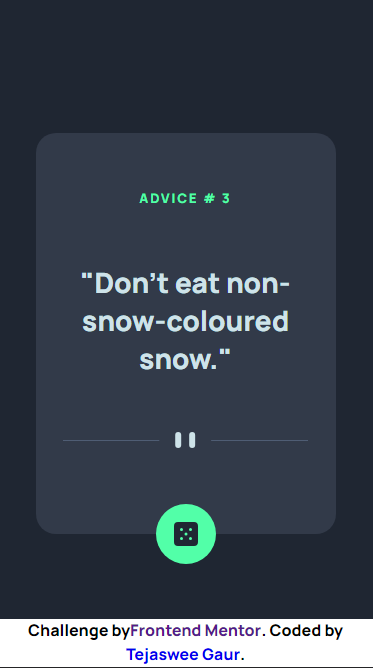

<!-- @format -->

# Frontend Mentor - Advice generator app solution

This repository contains my solution to the [Advice generator app challenge on Frontend Mentor](https://www.frontendmentor.io/challenges/advice-generator-app-QdUG-13db). by Frontend Mentor. The challenge is designed to help developers improve their coding skills by building realistic projects.

## Table of Contents

- [Overview](#overview)
  - [The Challenge](#the-challenge)
  - [Screenshot](#screenshot)
  - [Links](#links)
- [Features](#features)
- [My Approach](#my-approach)
- [Technologies Used](#technologies-used)
- [Getting Started](#getting-started)
- [Author](#author)
- [Acknowledgements](#acknowledgements)

## Overview

### The Challenge

The main goals of this challenge were:

- Create a responsive interface that works well on various screen sizes.
- Implement additional accessability of screen readers by using aria attributes.
- Dynamically Fetch Advices from the [Advice Slip JSON API](https://api.adviceslip.com/) and showcase the advice and advice Id in appropriate positions.
- Added some fun animations effects when advices are fetched.

### Screenshot

### Links

- [Solution on GitHub](https://github.com/TejasweeGaur/advice-generator-solution)
- [Live Site](https://tejasweegaur.github.io/advice-generator-solution/)

## Features

- Responsive layout that adjusts to different screen sizes.
- Interactive elements with hover and focus states for improved user experience.

## My Approach

I approached this challenge by first analyzing the design and breaking it down into smaller components. I then used semantic HTML5 markup to structure the content and employed CSS custom properties for easy styling. Flexbox and CSS Grid were my go-to choices for creating the responsive layout while ensuring optimal alignment and positioning of elements.

## Technologies Used

- HTML5
- CSS3 (Flexbox and CSS Grid)
- Javascript (fetch)

## Getting Started

To view the solution locally, you can follow these steps:

1. Clone the repository: `git clone https://github.com/TejasweeGaur/advice-generator-solution.git`
2. Navigate to the project directory.
3. Open the `index.html` file in your browser.

## Author

- Website: [Tejaswee Gaur](https://www.linkedin.com/in/tejaswee-gaur/)
- Frontend Mentor: [@TejasweeGaur](https://www.frontendmentor.io/profile/TejasweeGaur)

## Acknowledgements

I would like to express my gratitude to Frontend Mentor for providing this challenge, which allowed me to enhance my coding skills and learn new techniques. Additionally, I want to thank the developer community for their support and insights during the development process. Your feedback is greatly appreciated!

**Have fun coding !!** 🚀
